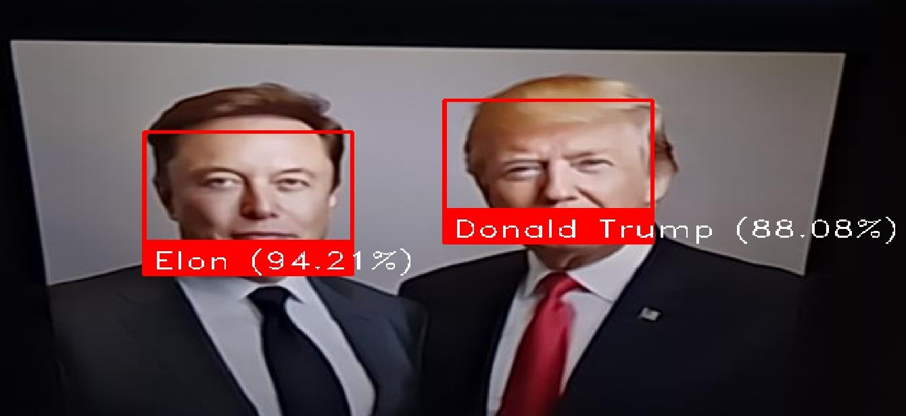

# Real-Time-Face-Recognition

## Overview

This project is a real-time face recognition system that uses Python, OpenCV, and the `face_recognition` library to detect, identify, and label faces from a live webcam feed or image files. It supports switching between multiple cameras and provides confidence scores for the matches.

---

## Features

- Encode faces from images stored in the `faces` directory.
- Real-time face detection and recognition using webcam input.
- Display labeled faces with confidence percentages.
- Easily switch between available cameras.
- Support for scalable processing by resizing frames for better performance.

---

## File Structure

- **`faces/`**: Directory containing images of known faces. Use filenames as labels (e.g., `john.jpg` for "John").
- **`test_images/`**: Directory for storing test input images.
- **`results/`**: Directory for saving outputs, such as labeled test images.
- **`main.ipynb`**: Jupyter notebook for testing and running the face recognition script.
- **`LICENSE`**: MIT License for the project.
- **`README.md`**: This file.

---

## Installation

### Step 1: Clone the Repository

```bash
git clone https://github.com/YourUsername/Real-Time-Face-Recognition.git
cd Real-Time-Face-Recognition
```

### Step 2: Create a Virtual Environment (Optional but Recommended)

```bash
python -m venv venv
source venv/bin/activate  # On Windows: venv\Scripts\activate
```

### Step 3: Install Dependencies

```bash
pip install -r requirements.txt
```

---

## Usage

### 1. Prepare the Faces Directory

- Add images of known individuals to the `faces` directory.
- File names will be used as labels (e.g., `alice.jpg` → "Alice").

### 2. Run the Face Recognition Script

```bash
python main.py
```

### 3. Interact During Execution

- Press `q` to quit the program.
- Press `s` to switch between webcams (if multiple cameras are available).

---

## Code Explanation

### Key Functions

1. **`encode_faces()`**
   - Reads images from the `faces` directory.
   - Encodes the faces and saves the encodings for recognition.

2. **`run_recognition()`**
   - Captures video frames from the webcam.
   - Detects and encodes faces in the current frame.
   - Matches detected faces with known encodings and labels them.
   - Displays the labeled faces in a live video feed.

3. **`face_confidence()`**
   - Calculates and returns a confidence percentage for each face match.

---

## Results

The program detects and labels faces in real-time with confidence percentages:

### Example Output

<div style="display: flex; justify-content: space-between;">
  
  
</div>

---

## Technologies Used

- **Python 3.10.12**
- **OpenCV**: `pip install opencv-python`
- **face_recognition**: `pip install face_recognition`
- **dlib**: For face encoding and matching.


---

## License

This project is licensed under the MIT License. See the [LICENSE](LICENSE) file for details.

---

## Contributing

Feel free to fork the repository and submit pull requests for new features, bug fixes, or enhancements.

---

## Acknowledgments

This project is inspired by the capabilities of OpenCV and the `face_recognition` library, which provides efficient and user-friendly APIs for face detection and recognition.
